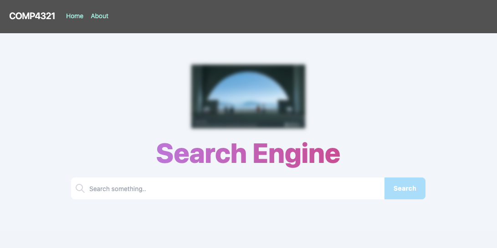

# COMP4321 Web Search Engine (backend)

**Solo project** — Course project for HKUST COMP 4321. A web search engine with three main parts: **crawler**, **retrieval system**, and **search engine website**.

- **Crawler**: Recursively fetches and parses textual data from the web and persists it for indexing.
- **Retrieval**: Applies TF×IDF, Google’s PageRank, and weighted search to user queries and parsed data, returning the top 50 results.
- **Website**: User-friendly interface to access the search engine.

### Highlights

- **Web crawler & indexer**: Implemented a multi-step pipeline for web data acquisition and storage. The crawler traverses the web recursively using a **breadth-first search (BFS)** strategy to discover and fetch pages in a controlled, level-by-level manner. A dedicated indexer processes the parsed content and persists it into a **custom-designed JDBM-backed schema**, enabling efficient storage and lookup for the retrieval layer.

- **Retrieval & ranking**: Built the search backend on the **vector space model**. Terms are weighted using **TF-IDF**; document–query similarity is computed via **cosine similarity**, and results are combined with **PageRank** and weighted scoring to produce the top-ranked results for each query.

*Course outcome: final grade A+.*

## Installation Guide
Please be noted that this part of the installation guide will only guide you through the process of installing the backend web server. Please refer to the README.md from the UI repository (folder) for instructions setting up the frontend UI.

### Prerequisite
#### Java
The project runs with Java 18.

#### IDE
The project is using IntelliJ IDEA. You can go to https://www.jetbrains.com/idea/, and install it.

#### Marven
Marven is used for dependency management for this project.

## Deploying the Web Scrapper (spider)
1. open `Main.java` in comp4321-Project
2. initially, `./src/database.db` and `./src/database.lg` contain the indexed 30 pages starting from http://www.cse.ust.hk/, find them and delete them before reproducing the result
3. run Main.java main

You can find the log in the console output

## Deploying the Search Engine
1. open `SearchEngineApplication.java` under `src/main/java/net/searchengine/searchengine/`
2. run SearchEngineApplication.java main

## Remark
You can set the path, including `DATABASE_PATH`, `RESULT_PATH`, `PHRASE_2_RESULT_PATH` and `FRONTEND_PATH` under the file in `src/main/java/net/searchengine/searchengine/uitil/Constants.java`

### Phase 1 Test Program
1. To retrieve the result from the db, open Phase1Test.java and right click "run"

The result will output to spider_result.txt

## Related Repositories

This is the frontend component of the COMP4321 Project. The backend is available at:
- [COMP4321-Project-frontend](https://github.com/terryychiuu/COMP4321-Project-frontend)

## Project Demo
- [Watch the demo on YouTube](https://youtu.be/VRCBY92hB9c)

